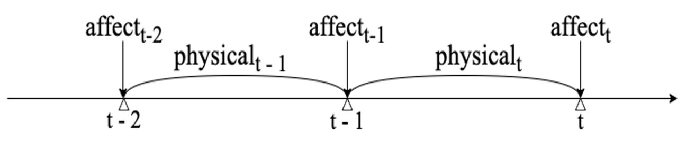
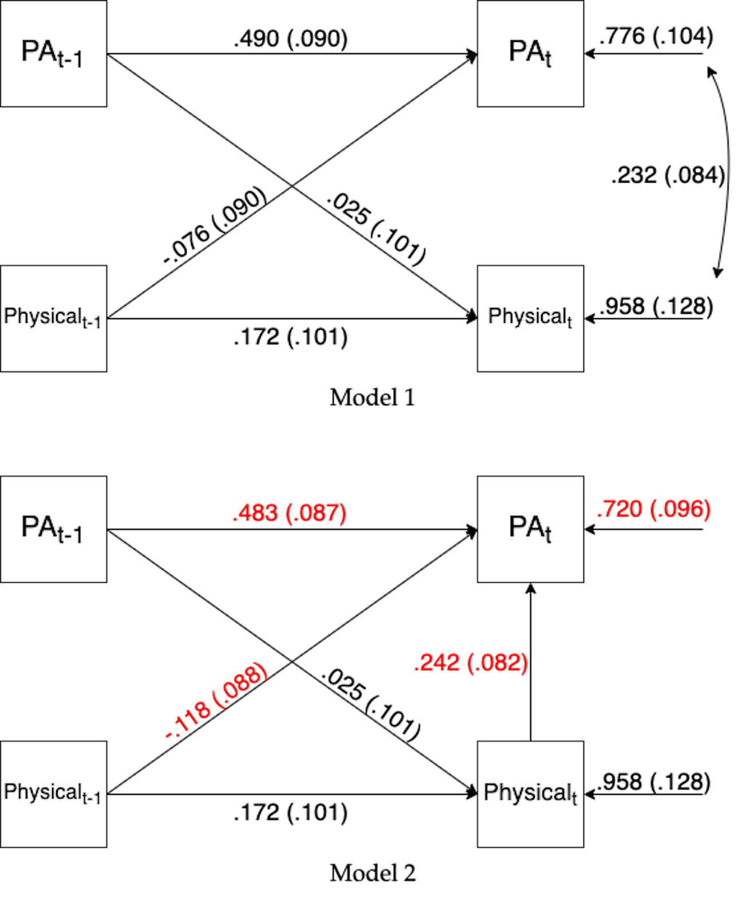
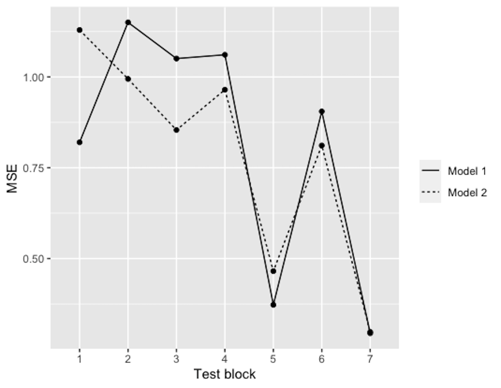

```{r setup, include=FALSE}
knitr::opts_chunk$set(echo = FALSE)
library(icons)
library(rsvg)
```

# Introduction

## Background   

Two common timeframes of ESM items: `momentary` (e.g. I feel ... *right now*) and `retrospective` (e.g. *Since the last beep*, I have been ...).\
`r icon_style(icons::fontawesome("thumbs-up", style = "solid"), fill = "#035AA6")` Vector autoregressive (`VAR`) models are powerful tools for testing **contemporaneous** and **lagged** effects among momentary variables.\
`r icon_style(icons::fontawesome("thumbs-down", style = "solid"), fill = "#035AA6")` When there is any retrospective variable involved, it is not clear whether contemporaneous or lagged effects should be tested.\
`r icon_style(icons::fontawesome("bell", style = "solid"), fill = "#035AA6")` ESM studies combining measures in both timeframes are common. Yet problems of overly relying on basic VAR models in such studies are not dealt with sufficiently, where contemporaneous relations are modelled as correlated residuals and unable to reflect any theory-based causal inference.

<!-- There are two common timeframes which ESM items refer to: the present moment (i.e., `momentary`) or a specific time interval in the past (i.e., `retrospective`). In a lag-one vector autoregressive model, the contemporaneous relations between variables are often of interest to researchers. When momentary and retrospective items are measured at the same prompt, modelling the undirected contemporaneous relations between them as correlated residuals is conceptually insufficient because the two types of items are actually asynchronous. This approach cannot test the potential causal effect which the retrospective item has on the momentary item, which could hamper the forming of valid causal inferences, an important goal for ESM research in clinical psychology.  -->

## The current study

Using data from a single-case study which included both momentary and retrospective measures, we explored the feasibility of a structural VAR (`SVAR`) model by comparing its **model fit indices** and performance in **cross-validation** with the corresponding VAR model.\
`r icon_style(icons::fontawesome("crown", style = "solid"), fill = "#035AA6")` The two models are observationally equivalent models and thus showed identical model fit indices.\
`r icon_style(icons::fontawesome("crown", style = "solid"), fill = "#035AA6")` Results of cross-validation suggest that the two models perform equally well in terms of predictive accuracy.\
`r icon_style(icons::fontawesome("lightbulb", style = "solid"), fill = "#035AA6")` $~$ Based on the results, we recommend that researchers consider the more theory-driven approach of modelling the unidirectional contemporaneous effect in relevant future applications.


<!-- In the current study, we explore another approach of modelling the directed contemporaneous effect by estimating the unidirectional path from the retrospective item to the momentary item instead of their correlated residuals. Based on data from a single-case study where momentary positive affect and retrospective physical activity were measured at an interval of 3 hours during the daytime, we compare the predictive accuracy of the two approaches using cross-validation techniques. Results suggest that the two approaches perform highly similarly in terms of model fit and predictive accuracy. Therefore, we recommend that researchers consider the more theory-driven approach of modelling the unidirectional contemporaneous effect in relevant future applications. -->

# Data collection and preprocessing

1. N = 1, fixed interval sampling (3h), 5 times/day, 28 days
2. Measurement: 0-100 VAS
  -	Positive affect (PA): “I feel cheerful/content *right now*.” `momentary`
  -	Physical activity: “I have been physically active *in the past 3 hours*.” `retrospective`
3. Example question: can the level of physical activity predict subsequent PA?
  -	PA<sub>t</sub> ~ Physical<sub>t</sub> + controls (lagged variables)
  
<center>

</center>

# Model specifications and results

1. Two ways of modelling contemporaneous relations
  - **Model 1: as correlated residuals in a standard VAR model**
  -	**Model 2: as a directed path in a structural VAR model**
2. Coefficients: see Figure 2
<center>

</center>

# Model comparison

1. __Model fit indices__: identical for the two models; χ<sup>2</sup> (5) = 39.661, CFI = 1.00, RMSEA = .00, SRMR = .00.\
`r icon_style(icons::fontawesome("ribbon", style = "solid"), fill = "#035AA6")` The two models are *equivalent models* (Pearl, 2009): Model 1 can generate every probability distribution that Model 2 can generate.\

2. __Blocked cross-validation__ (Snijders, 1988): highly similar performance between the two models (see Figure 3)\
<center>

</center>

# Conclusion and discussion

## Between the two models\   
Highly similar model fit and predictive accuracy yet __Model 2__ is more helpful for causal reasoning and further clinical implications.\
Therefore, when using VAR models with variables measured in different timeframes, consider:  
`r icon_style(icons::fontawesome("hourglass", style = "solid"), fill = "#035AA6")` Adapting the terminology used: the effect of physical activity on __subsequent__ PA is different from the traditional definition of both __lagged__ (similar meanings, different notations) and __contemporaneous__ (different meanings, similar notations) effects.\
`r icon_style(icons::fontawesome("key", style = "solid"), fill = "#035AA6")` Adapting model specifications based on theories: use SVAR models to model the effect of interest as a directed path.\

## Future directions\
This is the "simplest" example: N = 1, the retrospective period is the same as the interval between two momentary measurements.\
`r icon_style(icons::fontawesome("users", style = "solid"), fill = "#035AA6")` Consider doing such model comparisons in N > 1 studies by integrating multilevel analysis.\
`r icon_style(icons::fontawesome("mobile", style = "solid"), fill = "#035AA6")` $~$ Digital phenotyping and passive physiological measures which can collect data at a higher temporal resolution than subjective measures are increasingly used nowadays. How to aggregate the data from passive measures is then an additional key question.\

## Supplemental materials
Data and the R script can be accessed via `r icon_style(icons::fontawesome("github"), fill = "#035AA6")` :     https://github.com/YongZhangYZ/ESM-Network-meeting-poster.git  

<!-- # References -->
